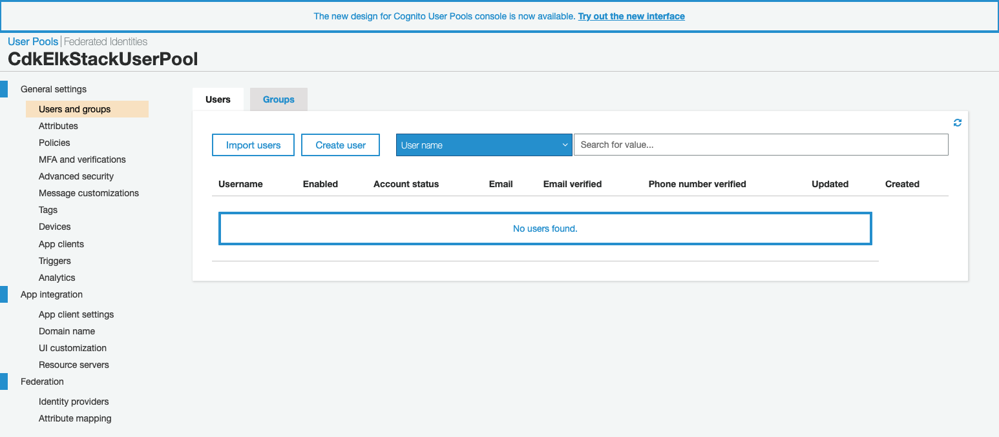
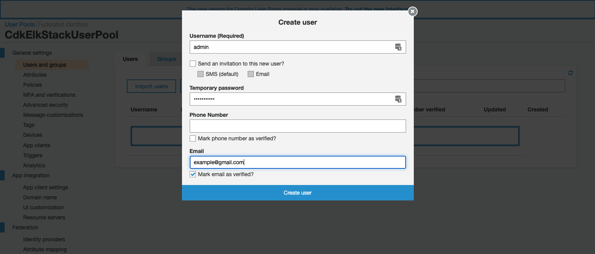
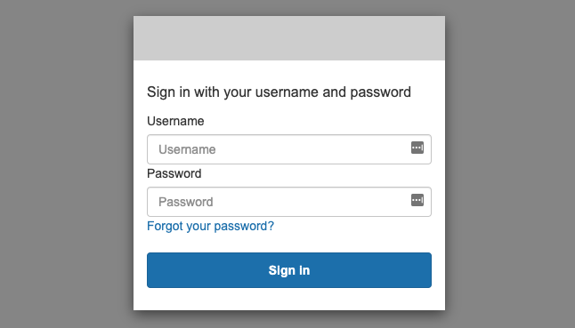
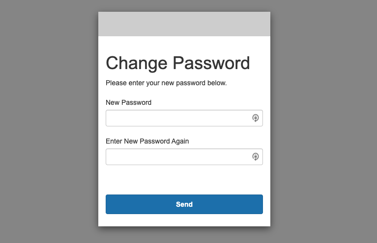
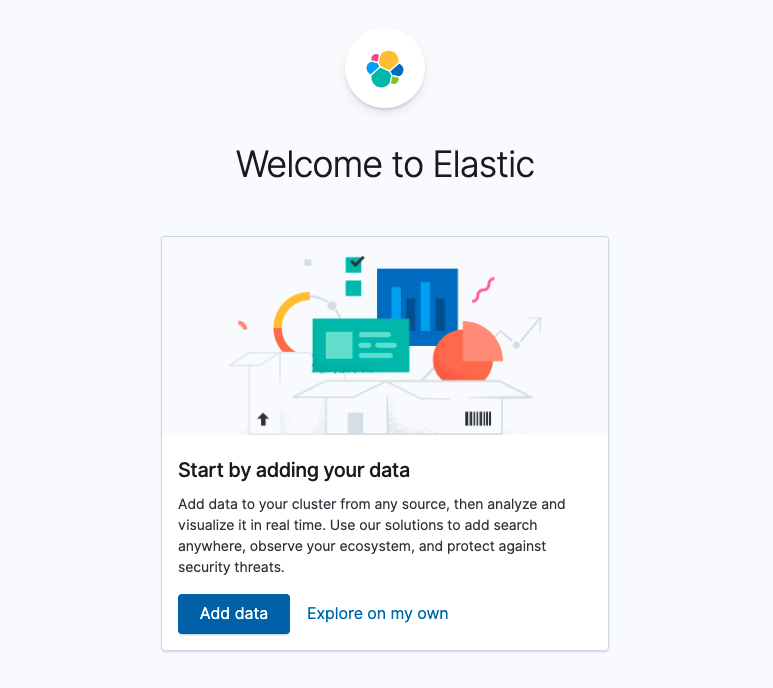

## Prerequisites

Make sure you have installed `Node.js` 10.13.0 or later.

Make sure you have configured your workstation with your `aws_access_key_id` & `aws_secret_access_key`. If you have the `AWS CLI` installed, run the following command.

```bash
# Provide your AWS access key ID, secret access key, and default region when prompted.
aws configure
```

Make sure you have installed the AWS CDK Toolkit globally.

```bash
npm install -g aws-cdk
cdk --version
```

## Initial Setup

In this tutorial, we will use `TypeScript` for the demo.

Let's initialize an empty AWS CDK project.

```bash
mkdir cdk-elk && cd $_
cdk init app --language typescript
```

Run the following command to verify that everything works correctly.

```bash
npm run cdk synth
```

This will output an empty CloudFormation template inside `cdk.out` folder. You should see a file named `CdkElkStack.template.json` created.

## Boostraping

Provision resources the AWS CDK needs to perform the deployment, e.g S3 bucket

```bash
cdk bootstrap
 ⏳  Bootstrapping environment aws://111111111111/ap-southeast-1...
Trusted accounts for deployment: (none)
Trusted accounts for lookup: (none)
Using default execution policy of 'arn:aws:iam::aws:policy/AdministratorAccess'. Pass '--cloudformation-execution-policies' to customize.
 ✅  Environment aws://111111111111/ap-southeast-1 bootstrapped (no changes).
```

## Create an AWS Cognito User Pool

Add an import statement at the beginning of `lib/cdk-elk-stack.ts`

```js {3,9-25}
import { Stack, StackProps } from "aws-cdk-lib";
import { Construct } from "constructs";
import * as cognito from "aws-cdk-lib/aws-cognito";

export class CdkElkStack extends Stack {
  constructor(scope: Construct, id: string, props?: StackProps) {
    super(scope, id, props);

    const userPool = new cognito.UserPool(this, "UserPool", {
      userPoolName: `${Stack.of(this).stackName}UserPool`,
      autoVerify: {
        email: true,
      },
      standardAttributes: {
        email: {
          mutable: true,
          required: true,
        },
      },
    });
    userPool.addDomain("UserPoolDomain", {
      cognitoDomain: {
        domainPrefix: "cdk-elk",
      },
    });
  }
}
```

A user pool is a user directory that stores your users that use to login to Kibana. We also need to specify the domain prefix for the Cognito login URL.

## Create an AWS Cognito Identity Pool

Note: Here we omitted the code to create user pool

```js {11-41}
import { Stack, StackProps } from "aws-cdk-lib";
import { Construct } from "constructs";
import * as cognito from "aws-cdk-lib/aws-cognito";

export class CdkElkStack extends Stack {
  constructor(scope: Construct, id: string, props?: StackProps) {
    super(scope, id, props);

    // User pool ...

    const identityPool = new cognito.CfnIdentityPool(this, "IdentityPool", {
      identityPoolName: `${Stack.of(this).stackName}IdentityPool`,
      allowUnauthenticatedIdentities: false,
    });

    // See https://docs.aws.amazon.com/cognito/latest/developerguide/role-based-access-control.html
    const authenticatedRole = new iam.Role(this, "AuthenticatedRole", {
      assumedBy: new iam.FederatedPrincipal(
        "cognito-identity.amazonaws.com",
        {
          StringEquals: {
            "cognito-identity.amazonaws.com:aud": identityPool.ref,
          },
          "ForAnyValue:StringLike": {
            "cognito-identity.amazonaws.com:amr": "authenticated",
          },
        },
        "sts:AssumeRoleWithWebIdentity"
      ),
    });

    new cognito.CfnIdentityPoolRoleAttachment(
      this,
      "IdentityPoolRoleAttachment",
      {
        identityPoolId: identityPool.ref,
        roles: {
          authenticated: authenticatedRole.roleArn,
        },
      }
    );
  }
}
```

A few things to notice:

- Identity pool creates unique identities for the authenticated user and attaches a role to that user.
- The role defines the permissions to access the AWS resources.
- Both user pool & identity pool will be used when we define the ES domain.

## Create an ES domain

Note: Here we omitted the code to create user pool & identity pool

```js {1,4-7,17-62}
import { CfnOutput, Stack, StackProps } from "aws-cdk-lib";
import { Construct } from "constructs";
import * as cognito from "aws-cdk-lib/aws-cognito";
import * as iam from "aws-cdk-lib/aws-iam";
import * as es from "aws-cdk-lib/aws-elasticsearch";
import { EbsDeviceVolumeType } from "aws-cdk-lib/aws-ec2";
import { ArnPrincipal, Effect } from "aws-cdk-lib/aws-iam";

export class CdkElkStack extends Stack {
  constructor(scope: Construct, id: string, props?: StackProps) {
    super(scope, id, props);

    // User pool ...

    // Identity pool ...

    // Allow Amazon ES to access Cognito
    const esRole = new iam.Role(this, "EsRole", {
      assumedBy: new iam.ServicePrincipal("es.amazonaws.com"),
    });
    esRole.addManagedPolicy({
      managedPolicyArn: "arn:aws:iam::aws:policy/AmazonESCognitoAccess",
    });

    const domain = new es.Domain(this, "Elasticsearch", {
      domainName: "cdk-elk",
      version: es.ElasticsearchVersion.V7_10,
      enableVersionUpgrade: true, // This allow in-place Elasticsearch version upgrade
      capacity: {
        dataNodeInstanceType: "t3.small.elasticsearch",
        dataNodes: 1, // For testing purpose, we only create 1 instance
      },
      ebs: {
        // Attach a 30GB GP2 volume
        enabled: true,
        volumeSize: 30,
        volumeType: EbsDeviceVolumeType.GP2,
      },
      accessPolicies: [
        // Allow authenticated users to access Kibana
        new iam.PolicyStatement({
          effect: Effect.ALLOW,
          principals: [new ArnPrincipal(authenticatedRole.roleArn)],
          actions: ["es:ESHttp*"],
          resources: [
            `arn:aws:es:${Stack.of(this).region}:${
              Stack.of(this).account
            }:domain/cdk-elk/*`,
          ],
        }),
      ],
      cognitoKibanaAuth: {
        userPoolId: userPool.userPoolId,
        identityPoolId: identityPool.ref,
        role: esRole,
      },
    });

    new CfnOutput(this, "ESKibanaUrl", {
      description: "Elastic Search Kibana Endpoint.",
      value: `https://${domain.domainEndpoint}/_plugin/kibana/`,
    });
  }
}
```

What's going on here?

- We declared an `IAM` role that allows Amazon ES to configure Cognito authentication for Kibana.
- We defined an ES domain with the access policies that allow the authenticated role we created previously to access it.
- We output the Kibana URL after the domain is created.

## Deploy the stack

```bash
cdk deploy
This deployment will make potentially sensitive changes according to your current security approval level (--require-approval broadening).
Please confirm you intend to make the following modifications:

...

Do you wish to deploy these changes (y/n)? y
CdkElkStack: deploying...
[0%] start: Publishing 70893b631249dc61260989e92e90d60ae94fbbec490a1e065680d77383084d8d:current_account-current_region
[50%] success: Published 70893b631249dc61260989e92e90d60ae94fbbec490a1e065680d77383084d8d:current_account-current_region
[50%] start: Publishing a1c436cf86403b1a2ba523b01c377b6cc24eddd60e78b76c9a24e5b28b071fd8:current_account-current_region
[100%] success: Published a1c436cf86403b1a2ba523b01c377b6cc24eddd60e78b76c9a24e5b28b071fd8:current_account-current_region
CdkElkStack: creating CloudFormation changeset...
 ✅  CdkElkStack

Outputs:
CdkElkStack.ESKibanaUrl = https://search-cdk-elk-ez34nbicxu5vu7abr7xz5sggiu.ap-southeast-1.es.amazonaws.com/_plugin/kibana/

Stack ARN:
arn:aws:cloudformation:ap-southeast-1:734282799255:stack/CdkElkStack/12327f80-7aa3-11ec-a781-0631acf18570
```

## Create an User in User Pool to access Kibana

Go to [AWS Cognito console](https://console.aws.amazon.com/cognito/home) to create a user to signin to Kibna.



Click the **Create User** button in the **Users** tab of the **Users and groups** tab.



Fill in the **Username**, **Temporary password**, and **Email**. Check **Mark email as verified?** and hit the **Create User** button.



When you log in for the first time. you will be prompted to change the temporary password.



Once you have reset the password, log in with the new password.


You should see this page after you log in successfully.



## Source code

https://github.com/xwlee/cdk-elk
