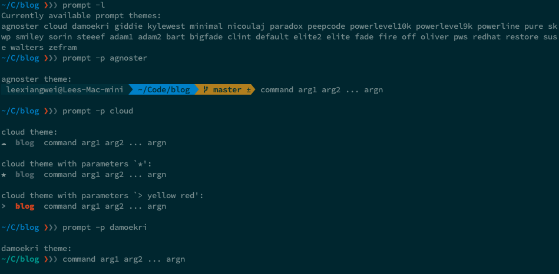

Recently, I just brought a new Mac Mini with the M1 chip. Thought it would be nice to make a post about how I set up my development machine from the ground up.

For the software compatibility, you can use this [website](https://isapplesiliconready.com/) to check.

## Install Homebrew

The first software to install for me always is `Homebrew`.

```shell
$ /bin/bash -c "$(curl -fsSL https://raw.githubusercontent.com/Homebrew/install/HEAD/install.sh)"
```

## Install git & vim

```shell
brew install git
brew install vim
```

### Setup Git config

```shell
git config --global user.name "Lee Xiang Wei"
git config --global user.email "xwlee2009@gmail.com"
```

## Install Node.js

> When I install via `Homebrew`, somehow I cannot run my `Node.js` scripts due to some error.

I use the pkg installer download from https://nodejs.org/en/download/.

## Install `Docker for Mac (Apple M1 Tech Preview)`

Download from https://docs.docker.com/docker-for-mac/apple-m1/

## Install other software

```shell
brew install --cask google-chrome
brew install --cask iterm2
brew install --cask alfred
brew install --cask keka # File archiver
brew install --cask vlc # Video player
brew install --cask thunder # Downloader
brew install --cask visual-studio-code
brew install --cask adobe-acrobat-reader
brew install --cask sequel-pro
brew install --cask postman
brew install --cask spotify
brew install --cask appcleaner
brew install --cask numi # Calculator
brew install --cask notion
brew install --cask mark-text # Markdown editor
brew install --cask fliqlo # Screensavers
brew install --cask firefox
brew install --cask keepingyouawake # Utility the prevent Mac from entering sleep mode
brew tap homebrew/cask-fonts
brew install --cask font-source-code-pro # The programming font I use
```

## Install prezto

[prezto](https://github.com/sorin-ionescu/prezto) is the configuration framework for Zsh shell.

It comes with modules and themes that allow you to customize your terminal.

To install prezto, run

```shell
git clone --recursive https://github.com/sorin-ionescu/prezto.git "${ZDOTDIR:-$HOME}/.zprezto"
```

Copy the configuration files

```shell
setopt EXTENDED_GLOB
for rcfile in "${ZDOTDIR:-$HOME}"/.zprezto/runcoms/^README.md(.N); do
  ln -s "$rcfile" "${ZDOTDIR:-$HOME}/.${rcfile:t}"
done
```

Append this to your `.zprofile` to make sure brew binary can be called when open new terminal.

```shell
eval $(/opt/homebrew/bin/brew shellenv)
```

Update `.zprofile` and change below section to `vim`

```shell
...
export EDITOR='vim'
export VISUAL='vim'
...
```

### Select a theme for your terminal

To list all the available themes

```shell
prompt -1
```

To preview a theme

```shell
prompt -p <theme>
```

To set a theme

```shell
prompt -s <theme>
```

Example themes


### Install a module for your terminal

You can browse [here](https://github.com/sorin-ionescu/prezto/tree/master/modules) for the available modules

To add a new module, open `~/.zpreztorc` and add the module to the following section

```shell
...
zstyle ':prezto:load' pmodule \
  'environment' \
  'terminal' \
  'editor' \
  'history' \
  'directory' \
  'spectrum' \
  'utility' \
  'completion' \
  'prompt' \
  # Add new module here
...
```

Then you need to reload `~/.zpreztorc`

```shell
source ~/.zpreztorc
```

## Install vundle, the plugin manager for vim

git clone https://github.com/VundleVim/Vundle.vim.git ~/.vim/bundle/Vundle.vim

Add below code to the top of your `.vimrc`, these are the plugins I used. Feel free to change the plugin.

```shell
set nocompatible
filetype off

" Set the runtime path to include Vundle and initialize
set rtp+=~/.vim/bundle/Vundle.vim
call vundle#begin()
" Alternatively, pass a path where Vundle should install plugins
"call vundle#begin('~/some/path/here')

" Let Vundle manage Vundle, required
Plugin 'gmarik/Vundle.vim'

Plugin 'altercation/Vim-colors-solarized'
Plugin 'ervandew/supertab'
Plugin 'kien/ctrlp.vim'
Plugin 'Lokaltog/powerline', {'rtp': 'powerline/bindings/vim/'}
Plugin 'Raimondi/delimitMate'
Plugin 'scrooloose/nerdtree'
Plugin 'scrooloose/nerdcommenter'
Plugin 'tpope/vim-surround'

" All of your Plugins must be added before the following line
call vundle#end()
filetype plugin indent on
```

To install from command line, run

```shell
vim +PluginInstall +qall
```
